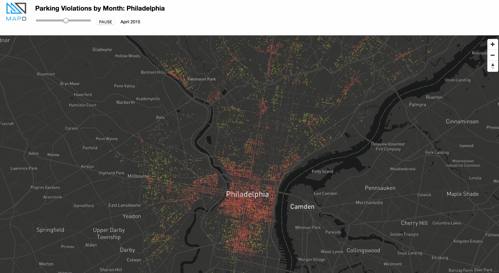

# Demo from FOSS4G NA 2018: Philly Parking Violations

A barebones example of using the Vega spec for [OmniSci backend rendering](https://www.omnisci.com/platform/render/) with MapBoxGL.JS. Parking violations data obtained from [Open Data Philly](https://www.opendataphilly.org/dataset/parking-violations).

Note: You need a Mapbox API key in order to use this repo (set the value [here](https://github.com/omnisci/mapd-vega-mapboxgl-demo-philly-parking/blob/master/src/components/map.js#L6)), as well as OmniSci Enterprise Edition for its backend rendering capabilities.



## Install

Using `yarn`

```
yarn install
```

## Develop

To start the `webpack-dev-server`:

```
npm start
```

then open your browser to `http://localhost:8080`

## Deploy

_...to do..._

## Author
Chris Henrick ([@clhenrick](http://github.com/clhenrick))
